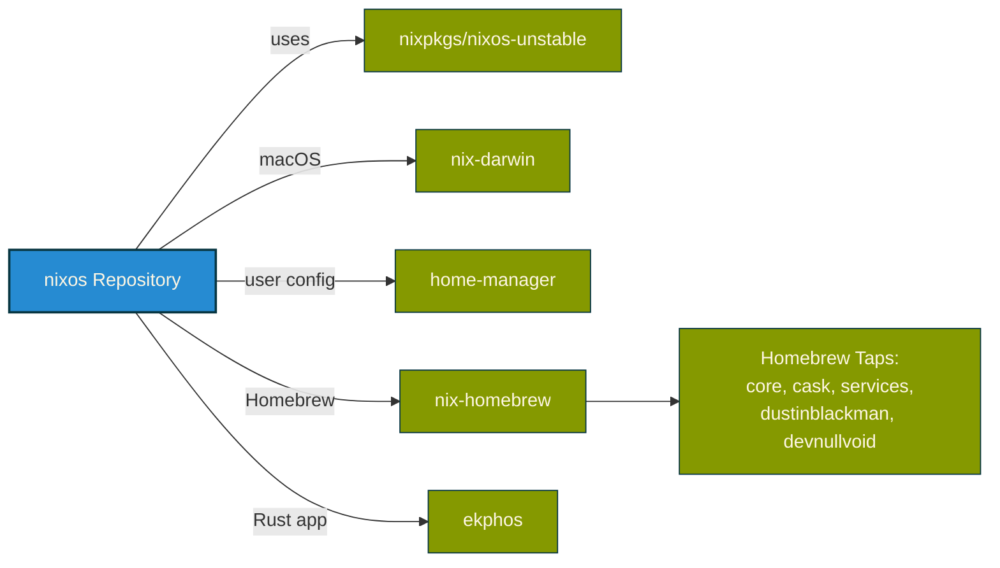

# NixOS Repository Architecture

## File Relationships Diagram

```mermaid
graph TD
    %% Root Flake
    Root[flake.nix<br/>Root Entry Point]
    
    %% Inputs
    Root --> |imports| NixPkgs[nixpkgs]
    Root --> |imports| NixDarwin[nix-darwin]
    Root --> |imports| NixHomebrew[nix-homebrew]
    Root --> |imports| Homebrew[homebrew taps]
    
    %% NixOS Configuration
    Root --> |nixosConfigurations.neon| NeonConfig[systems/neon/configuration.nix]
    NeonConfig --> |imports| T3610[systems/neon/t3610.nix<br/>Hardware Config]
    NeonConfig --> |imports| OctoPrint[modules/octoprint.nix]
    NeonConfig --> |imports| Syncthing[modules/syncthing.nix]
    
    %% Darwin Configuration
    Root --> |darwinConfigurations| DarwinModule[systems/darwin/flake-module.nix<br/>Darwin Factory]
    
    DarwinModule --> |generates| IntelMac[Matts-MacBook-Pro<br/>x86_64-darwin]
    DarwinModule --> |generates| M5Mac[Matts-M5<br/>aarch64-darwin]
    
    %% Common Darwin Config
    IntelMac --> |imports| CommonDarwin[systems/darwin/common/default.nix<br/>Shared macOS Config]
    IntelMac --> |imports| CommonBrew[systems/darwin/common/brew.nix<br/>Shared Homebrew]
    IntelMac --> |imports| IntelHost[systems/darwin/hosts/Matts-MacBook-Pro.nix<br/>Intel-Specific]
    
    M5Mac --> |imports| CommonDarwin
    M5Mac --> |imports| CommonBrew
    M5Mac --> |imports| M5Host[systems/darwin/hosts/Matts-M5.nix<br/>Apple Silicon-Specific]
    
    %% Home Manager
    Root --> |runs after system| HomeFlake[users/matt/flake.nix<br/>Home Manager Entry]
    
    HomeFlake --> |homeConfigurations| HomeConfigs{Architecture<br/>Detection}
    HomeConfigs --> |x86_64-linux| NeonHome[matt@neon]
    HomeConfigs --> |x86_64-darwin| IntelHome[matt@Matts-MacBook-Pro]
    HomeConfigs --> |aarch64-darwin| M5Home[matt@Matts-M5]
    
    %% Home Manager Modules
    NeonHome --> |imports| HomeNix[users/matt/home.nix<br/>Main Home Config]
    IntelHome --> |imports| HomeNix
    M5Home --> |imports| HomeNix
    
    HomeNix --> |imports| Neovim[users/matt/modules/neovim.nix]
    HomeNix --> |imports| TaskWarrior[users/matt/modules/taskwarrior.nix]
    HomeNix --> |imports| Palitronica[users/matt/modules/palitronica.nix]
    
    %% Linux-Only Modules
    HomeNix --> |Linux only| I3[users/matt/modules/i3.nix]
    HomeNix --> |Linux only| Polybar[users/matt/modules/polybar.nix]
    HomeNix --> |Linux only| Rofi[users/matt/modules/rofi.nix]
    HomeNix --> |Linux only| CodeServer[users/matt/modules/code-server.nix]
    HomeNix --> |Linux only| Neomutt[users/matt/modules/neomutt.nix]
    
    %% Legacy (Gitignored)
    LegacyMac[systems/Matts-MacBook-Pro/<br/>Legacy - Gitignored]
    
    %% Styling
    classDef rootNode fill:#268bd2,stroke:#073642,stroke-width:3px,color:#fdf6e3
    classDef darwinNode fill:#859900,stroke:#073642,stroke-width:2px,color:#fdf6e3
    classDef nixosNode fill:#dc322f,stroke:#073642,stroke-width:2px,color:#fdf6e3
    classDef homeNode fill:#cb4b16,stroke:#073642,stroke-width:2px,color:#fdf6e3
    classDef moduleNode fill:#6c71c4,stroke:#073642,stroke-width:1px,color:#fdf6e3
    classDef inputNode fill:#2aa198,stroke:#073642,stroke-width:1px,color:#fdf6e3
    classDef legacyNode fill:#586e75,stroke:#073642,stroke-width:1px,stroke-dasharray:5,color:#fdf6e3
    
    class Root rootNode
    class DarwinModule,IntelMac,M5Mac,CommonDarwin,CommonBrew,IntelHost,M5Host darwinNode
    class NeonConfig,T3610,OctoPrint,Syncthing nixosNode
    class HomeFlake,HomeConfigs,NeonHome,IntelHome,M5Home,HomeNix homeNode
    class Neovim,TaskWarrior,Palitronica,I3,Polybar,Rofi,CodeServer,Neomutt moduleNode
    class NixPkgs,NixDarwin,NixHomebrew,Homebrew inputNode
    class LegacyMac legacyNode
```

## Legend

- **Blue (Root)**: Main entry point (`flake.nix`)
- **Green (Darwin)**: macOS/nix-darwin configuration files
- **Red (NixOS)**: Linux/NixOS configuration files
- **Orange (Home)**: Home Manager user configuration
- **Purple (Modules)**: Reusable module files
- **Cyan (Inputs)**: External flake inputs
- **Gray (Legacy)**: Deprecated/gitignored files

## Key Architecture Patterns

### 1. Multi-Architecture Support
```nix
# Single factory generates both:
darwinConfigurations = {
  "Matts-MacBook-Pro" = mkDarwinSystem "Matts-MacBook-Pro";  # x86_64
  "Matts-M5" = mkDarwinSystem "Matts-M5";                     # aarch64
}
```

### 2. Shared Configuration with Host-Specific Overrides
```
systems/darwin/
├── common/          # Shared across all Macs
│   ├── default.nix  # System packages, settings
│   └── brew.nix     # Homebrew formulae & casks
└── hosts/           # Architecture-specific
    ├── Matts-MacBook-Pro.nix  # hostPlatform = "x86_64-darwin"
    └── Matts-M5.nix           # hostPlatform = "aarch64-darwin"
```

### 3. Platform-Aware Package Filtering
```nix
# In common/default.nix
environment.systemPackages = with pkgs; [
  # ... common packages ...
] ++ lib.optionals (!pkgs.stdenv.isDarwin || pkgs.stdenv.hostPlatform.isx86_64) [
  iproute2mac  # Intel-only
];

# In common/brew.nix
casks = [ ... ] ++ lib.optionals pkgs.stdenv.hostPlatform.isx86_64 [
  "virtualbox"  # Intel-only
];
```

### 4. Auto-Detection Flow
```
nix run .
  ├── Detects OS (Darwin/Linux)
  ├── Detects hostname (hostname -s)
  ├── Runs: darwin-rebuild switch --flake .#${hostname}
  └── Runs: home-manager switch --flake ./users/matt#matt@${hostname}
```

## Entry Points by Use Case

### Build Current System
```bash
nix run .                                          # Auto-detect everything
```

### Build Specific System
```bash
darwin-rebuild switch --flake .#Matts-MacBook-Pro # Intel Mac
darwin-rebuild switch --flake .#Matts-M5          # M5 Mac
sudo nixos-rebuild switch --flake .#neon          # NixOS server
```

### Home Manager Only
```bash
home-manager switch --flake ./users/matt          # Auto-detect
home-manager switch --flake ./users/matt#matt@Matts-M5  # Explicit
```

## Module Activation by Platform

| Module | NixOS (neon) | Intel Mac | M5 Mac |
|--------|--------------|-----------|---------|
| neovim | ✓ | ✓ | ✓ |
| tmux/zsh/kitty | ✓ | ✓ | ✓ |
| taskwarrior | ✓ | ✓ | ✓ |
| i3/polybar/rofi | ✓ | ✗ | ✗ |
| aerospace | ✗ | ✓ | ✓ |
| virtualbox | ✗ | ✓ | ✗ |
| iproute2mac | ✗ | ✓ | ✗ |
| rosetta | ✗ | ✗ | ✓ |

## External Dependencies


